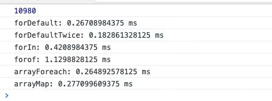

数组的遍历方法有很多，如何能合理的选择哪一个去使用，这一点很重要，下面我们讲讲可以将数组遍历的方法，并学会在各个情况下合理使用

```js
  // 数组遍历的方法，即触发的时间
  let arr = [2,9,7,6,8,5,1,3,2,9,7,6,8,5,1,3,2,9,7,6,8,5,1,3,2,9,7,6,8,5,1,3,2,9,7,6,8,5,1,3,2,9,7,6,8,5,1,3,2,9,7,6,8,5,1,3,2,9,7,6,8,5,1,3,2,9,7,6,8,5,1,3,2,9,7,6,8,5,1,3,2,9,7,6,8,5,1,3,2,9,7,6,8,5,1,3,2,9,7,6,8,5,1,3,2,9,7,6,8,5,1,3,2,9,7,6,8,5,1,3,2,9,7,6,8,5,1,3,2,9,7,6,8,5,1,3,2,9,7,6,8,5,1,3,2,9,7,6,8,5,1,3,2,9,7,6,8,5,1,3,2,9,7,6,8,5,1,3,2,9,7,6,8,5,1,3,2,9,7,6,8,5,1,3,2,9,7,6,8,5,1,3,2,9,7,6,8,5,1,3,2,9,7,6,8,5,1,3,2,9,7,6,8,5,1,3,2,9,7,6,8,5,1,3,2,9,7,6,8,5,1,3,2,9,7,6,8,5,1,3,2,9,7,6,8,5,1,3,2,9,7,6,8,5,1,3,2,9,7,6,8,5,1,3,2,9,7,6,8,5,1,3,2,9,7,6,8,5,1,3,2,9,7,6,8,5,1,3,2,9,7,6,8,5,1,3,2,9,7,6,8,5,1,3,2,9,7,6,8,5,1,3,2,9,7,6,8,5,1,3,2,9,7,6,8,5,1,3,2,9,7,6,8,5,1,3,2,9,7,6,8,5,1,3,2,9,7,6,8,5,1,3,2,9,7,6,8,5,1,3,2,9,7,6,8,5]
  arr = [...arr,...arr,...arr,...arr,...arr,...arr,...arr,...arr,...arr,...arr,...arr,...arr,...arr,...arr,...arr,...arr,...arr,...arr,...arr,...arr,...arr,...arr,...arr,...arr,...arr,...arr,...arr,...arr,...arr,...arr]
  console.log(arr.length)
  // 默认的for循环
  function forDefault (){
    for( let i = 0;i< arr.length;i++){
    }
  }
  // for循环增强版
  function forDefaultTwice (){
    for( let i = 0,j = arr.length;i< j;i++){
    }
  }
  // forin 循环 i 为key
  function forIn (){
    for( let i in arr){
    }
  }
  // forof 循环es6 i 为value
  function forof (){
    for( let i of arr){
    }
  }
  // foreach
  function arrayForeach(){
    arr.forEach(()=>{

    })
  }
  // foreach
  function arrayMap(){
    arr.map((i)=>{
      return i
    })
  }
  consoleTime(forDefault)
  consoleTime(forDefaultTwice)
  consoleTime(forIn)
  consoleTime(forof)
  consoleTime(arrayForeach)
  consoleTime(arrayMap)
  //函数执行时间
  function consoleTime(fn){
    if(typeof fn !== 'function'){
      throw(`${fn} is not a function`)
      return
    }
    console.time(fn.name)
    fn()
    console.timeEnd(fn.name)
  }
```


1. 数组默认的for循环遍历
  - 可以使用break、continue、return 对遍历进行 终止和操作
  - 将 长度保存下来，是性能最好的(推荐使用)
2. for in 
  - 可以遍历对象的可美剧属性，并且可以拿到对象原型链上的方法，效率不高
  ```js
  for(let i in arrNum){
    console.log(i) // 0 1 2 3 4 5 且为字符串
  }
  Object.prototype.objCustom = function() {};
  Array.prototype.arrCustom = function() {};
  const iterable = [3, 5, 7];
  iterable.foo = 'hello';
  for (const i in iterable) {
    console.log(i); //  0, 1, 2, "foo", "arrCustom", "objCustom"
  }
  for (const i in iterable) {
    if (iterable.hasOwnProperty(i)) {
      console.log(i); //  0, 1, 2, "foo"
    }
  }
  ```
3. for of es6 新增的
  - 不可以遍历对象
  - 遍历的都是类似Generate 数据结构
4. foreach es5新出的 
  - 简单
  - 不能使用brack、continue，并且使用 return 没用
5. map
  - 必须有返回值，否则 会返回undefined
  ```js
  let arrNum = [2,7,8,5,1,9]
  let arrMap = arrNum.map( x => {
    return 10
  })
  console.log(arrNum,arrMap) //[2, 7, 8, 5, 1, 9] (6) [10, 10, 10, 10, 10, 10]
  let arrMap1 = arrNum.map( () => {
  })
  console.log(arrMap1) ['undefined', 'undefined', 'undefined', 'undefined', 'undefined', 'undefined']
  ```

