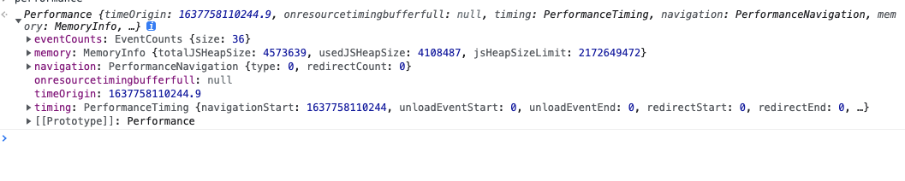
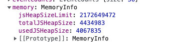
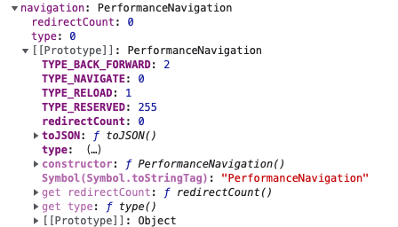
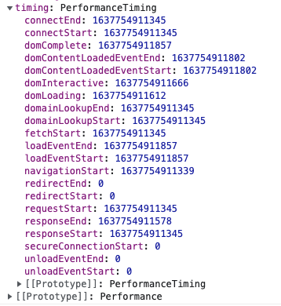
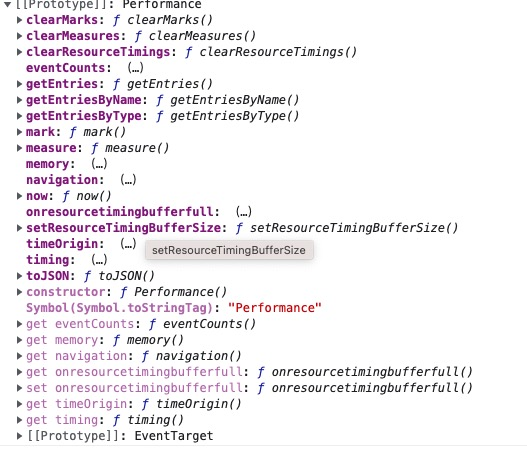
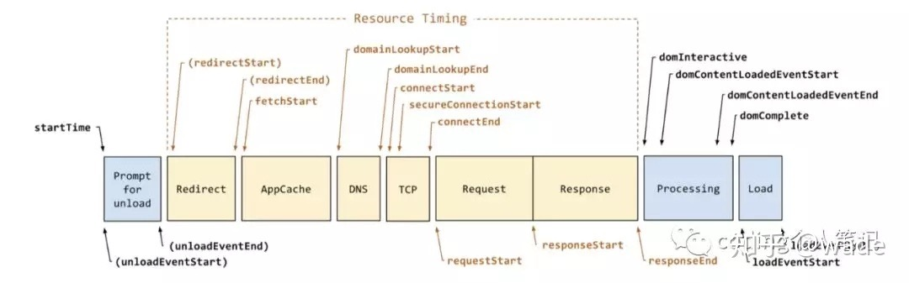

## performance 性能监控

### 什么是performance？
performance 接口可以获取到当前页面中与性能相关的信息
使用：
```js
  window.performance() || window.webkitPerformance() || window.mosPerformance()
```


属性：
  -  memory 浏览器的内存使用情况
    - totalJSHeapSize 可以使用的js内存，单位字节B
    - usedJSHeapSize 已经可以使用的内存大小，单位字节B
    - jsHeapSizeLimit 内存大小限制，单位字节B



  -  navigation 页面的来源信息
    - redirectCount 页面重定向的次数，几次跳转过来
    - type 页面的打开方式
      - 0 正常打开页面，非刷新和非重定向
      - 1 通过window.location.reload 刷新的页面 
      - 2 通过浏览器的前进后退进入页面
      - 255 其它方式



  - timing 记录页面渲染各个时间段所花费的时间
    - connectStart	HTTP请求开始向服务器发送时的时间戳，如果是持久连接，则等同于fetchStart
    - domComplete	当前网页DOM结构生成时，也就是Document.readyState属性变为“complete”,并且相应的readystatechange事件触发时的时间戳
    - domContentLoadedEventEnd	当前网页DOMContentLoaded事件发生时，也就是DOM结构解析完毕、所有脚本运行完成时的时间戳
    - domContentLoadedEventStart	当前网页DOMContentLoaded事件发生时，也就是DOM结构解析完毕、所有脚本开始运行时的时间戳
    - domInteractive	当前网页DOM结构结束解析、开始加载内嵌资源时，也就是Document.readyState属性变为“interactive”、并且相应的readystatechange事件触发时的时间戳
    - domLoading	当前网页DOM结构开始解析时,也就是Document.readyState属性变为“loading”、并且相应的readystatechange事件触发时的时间戳
    - domainLookupEnd	域名查询结束时的时间戳。如果使用持久连接，或者从本地缓存获取信息的，等同于fetchStart
    - domainLookupStart	域名查询开始时的时间戳。如果使用持久连接，或者从本地缓存获取信息的，等同于fetchStart
    - fetchStart	浏览器准备通过HTTP请求去获取页面的时间戳。在检查应用缓存之前发生。
    - loadEventEnd	当前网页load事件的回调函数结束时的时间戳。如果该事件还没有发生，返回0。
    - loadEventStart	当前网页load事件的回调函数开始时的时间戳。如果该事件还没有发生，返回0。
    - navigationStart	当前浏览器窗口的前一个网页关闭，发生unload事件时的时间戳。如果没有前一个网页，就等于fetchStart
    - redirectEnd	最后一次重定向完成，也就是Http响应的最后一个字节返回时的时间戳。如果没有重定向，或者上次重定向不是同源的。则为0
    - redirectStart	第一次重定向开始时的时间戳，如果没有重定向，或者上次重定向不是同源的。则为0
    - requestStart	浏览器向服务器发出HTTP请求时（或开始读取本地缓存时）的时间戳。
    - responseEnd	浏览器从服务器收到（或从本地缓存读取）最后一个字节时（如果在此之前HTTP连接已经关闭，则返回关闭时）的时间戳  
    - responseStart	浏览器从服务器收到（或从本地缓存读取）第一个字节时的时间戳
    - secureConnectionStart	浏览器与服务器开始安全链接的握手时的时间戳。如果当前网页不要求安全连接，则返回0
    - unloadEventEnd	如果前一个网页与当前网页属于同一个域下，则表示前一个网页的unload回调结束时的时间戳。如果没有前一个网页，或者之前的网页跳转不是属于同一个域内，则返回值为0
    - unloadEventStart	如果前一个网页与当前网页属于同一个域下，则表示前一个网页的unload事件发生时的时间戳。如果没有前一个网页，或者之前的网页跳转不是属于同一个域内，则返回值为0



方法：
  - performance.getEntries 获取资源的请求时间，css、js
  - performance.mark 主要用于创建标记
  - performance.measure 主要用于记录两个标记的时间间隔




### 使用performance.timing 来计算浏览器的各项消耗


从上图可以得出
```js
"重定向耗时": redirectEnd - redirectStart
"Appcache耗时": domainLookupStart - fetchStart
"DNS查询耗时":  domainLookupEnd - domainLookupStart
"TCP链接耗时":  connectEnd - connectStart
"HTTP请求耗时": responseEnd - responseStart
"请求完毕到DOM加载耗时": domInteractive - responseEnd
"解析DOM树耗时": domComplete - domInteractive
"白屏时间耗时": responseStart - navigationStart
"load事件耗时": loadEventEnd - loadEventStart
"页面加载完成的时间": loadEventEnd - responseStart
```

封装出来的工具
```js
/**
 * @file: performance.js
 * @author: zx
 * @description: 页面性能统计
 */
import {
  formatMs,
  isObject,
  checkResourceType
} from './performanceUtils.js'

// 构造函数
class Performance {
  constructor() {
    // 保存原始数据
    this.timing = {}
    // 原始enteries数据
    this.enteriesResouceData = []
    // 保存解析后的数据
    this.afterDatas = {
      timingFormat: {},
      enteriesResouceDataFormat: {},
      enteriesResouceDataTiming: {
        "js": 0,
        "css": 0,
        "image": 0,
        "video": 0,
        "others": 0
      }
    }
  }
  // 获取数据信息
  getPerformanceTiming() {
    // 初始化数据
    this.init()
    if (!isObject(this.timing)) {
      console.log('值需要是一个对象类型')
      return
    }
    // 过早获取 loadEventEnd值会是0
    var loadTime = this.timing.loadEventEnd - this.timing.navigationStart
    if (loadTime < 0) {
      setTimeout(() => {
        this.getPerformanceTiming()
      }, 200)
      return
    }
    // 获取解析后的数据
    this.afterDatas.timingFormat = this._setTiming(loadTime)
    this.afterDatas.enteriesResouceDataFormat = this._setEnteries();
    this._show()
  }
  init() {
    this.timing = window.performance.timing;
    // 获取资源类型为 resource的所有数据
    this.enteriesResouceData = window.performance.getEntriesByType('resource');
  }
  _show() {
    console.table(this.afterDatas.timingFormat)
    for (var key in this.afterDatas.enteriesResouceDataFormat) {
      console.group(key + "--- 共加载时间" + formatMs(this.afterDatas.enteriesResouceDataTiming[key]))
      console.table(this.afterDatas.enteriesResouceDataFormat[key])
      console.groupEnd(key)
    }
  }
  _setTiming (loadTime) {
    var timing = this.timing
    // 对数据进行计算
    var data = {
      "重定向耗时": formatMs(timing.redirectEnd - timing.redirectStart),
      "Appcache耗时": formatMs(timing.domainLookupStart - timing.fetchStart),
      "DNS查询耗时": formatMs(timing.domainLookupEnd - timing.domainLookupStart),
      "TCP链接耗时": formatMs(timing.connectEnd - timing.connectStart),
      "HTTP请求耗时": formatMs(timing.responseEnd - timing.responseStart),
      "请求完毕到DOM加载耗时": formatMs(timing.domInteractive - timing.responseEnd),
      "解析DOM树耗时": formatMs(timing.domComplete - timing.domInteractive),
      "白屏时间耗时": formatMs(timing.responseStart - timing.navigationStart),
      "load事件耗时": formatMs(timing.loadEventEnd - timing.loadEventStart),
      "页面加载完成的时间": formatMs(loadTime)
    }
    return data
  }
  _setEnteries () {
    var enteriesResouceData = this.enteriesResouceData;
    var imageArrs = [], jsArrs = [], cssArrs = [], videoArrs = [], otherArrs = [];
    enteriesResouceData.map(item => {
      var d = {
        '资源名称': item.name,
        'HTTP协议类型': item.nextHopProtocol,
        "TCP链接耗时": formatMs(item.connectEnd - item.connectStart),
        "加载时间": formatMs(item.duration)
      };
      switch (checkResourceType(item.name)) {
        case 'image':
          this.afterDatas.enteriesResouceDataTiming.image += item.duration
          imageArrs.push(d)
          break
        case 'javascript':
          this.afterDatas.enteriesResouceDataTiming.js += item.duration
          jsArrs.push(d)
          break
        case 'css':
          this.afterDatas.enteriesResouceDataTiming.css += item.duration
          cssArrs.push(d)
          break
        case 'video':
          this.afterDatas.enteriesResouceDataTiming.video += item.duration
          videoArrs.push(d)
          break
        case 'others':
          this.afterDatas.enteriesResouceDataTiming.others += item.duration
          otherArrs.push(d)
          break
      }
    })
    return {
      'js': jsArrs,
      'css': cssArrs,
      'image': imageArrs,
      'video': videoArrs,
      'others': otherArrs
    }
  }
}
var Per = new Performance()
export default Per

/**
 * @file: performanceUtils.js
 * @author: zx
 * @description: 性能检测工具
 */

export function isObject(obj) {
  return obj !== null && (typeof obj === 'object')
}
// 格式化成毫秒
export function formatMs(time) {
  if (typeof time !== 'number') {
    console.log('时间必须为数字')
    return
  }
  // 毫秒转换成秒 返回
  if (time > 1000) {
    return (time / 1000).toFixed(2) + 's';
  }
  // 默认返回毫秒
  return Math.round(time) + 'ms';
}
export function isImg(param) {
  if (/\.(gif|jpg|jpeg|png|webp|svg)/i.test(param)) return true
  return false
}
export function isJS(param) {
  if (/\.(js)/i.test(param)) return true
  return false
}
export function isCss(param) {
  if (/\.(css)/i.test(param)) return true
  return false
}
export function isVideo(param) {
  if (/\.(mp4|rm|rmvb|mkv|avi|flv|ogv|webm)/i.test(param)) return true
  return false
}
export function checkResourceType(param) {
  if (isImg(param)) return 'image'
  if (isJS(param)) return 'javascript'
  if (isCss(param)) return 'css'
  if (isVideo(param)) return 'video'
  return 'other'
}
```